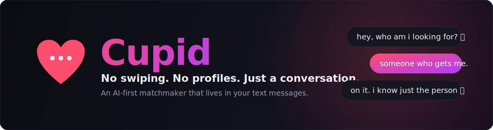

<div align="center">



# Cupid

**The matchmaker that lives in your text messages.**

No swiping. No profiles. No endless feed. You text a number, have a real conversation with an AI that actually remembers you, and it introduces you to someone worth meeting.


</div>

---

## What is Cupid?

Cupid is an **SMS-native, AI-first matchmaker**. Instead of optimizing photos and swiping through strangers, you just text. Claude runs the whole conversation, learns who you are and what you actually want through natural dialogue, and proposes matches when it has real confidence, not a shotgun of "people near you."

When two people are both interested, Cupid opens an **anonymous, time-limited video room** so they meet face to face before any names or numbers change hands. Contact details are only exchanged after both sides say yes.

It is designed to feel less like an app and more like texting a perceptive friend who happens to know a lot of single people.

## How it works

1. **Text the Cupid number.** A Twilio webhook hands the message to a Cloud Function.
2. **Conversational onboarding.** Claude gathers your profile across natural stages (greeting -> basics -> what you're looking for -> personality -> dealbreakers) without it ever feeling like a form.
3. **Matching, two ways.** A nightly job scores the whole active pool, and *instant matching* fires the moment a strong new candidate finishes onboarding, so people who have been waiting get introduced right away.
4. **Anonymous video first.** Mutual interest opens a Daily.co room; both links go out at once. No identifying info shared yet.
5. **Follow-up.** After the call, Cupid checks in like a friend would and asks if you want to exchange contact info.
6. **Consent to connect.** Only when both agree do names and numbers cross over.

## Highlights

- **Three-layer memory.** Rolling conversation window (episodic) + an extracted structured profile (distilled) + a longer-term relationship narrative, so Cupid remembers you naturally across weeks.
- **Compatibility scoring oracle.** Weighted matching on relationship-intent alignment, shared interests, shared values, and personality complementarity, with hard filters for gender preference, age range, location, and dealbreakers.
- **Brand-safe voice, enforced in code.** A deterministic sanitizer at the send choke point guarantees Cupid never ships an em-dash or AI-ism even if the model slips.
- **Sex-positive and consent-first.** Casual intent is a valid intent; matches are made consent-to-consent and never moralized.
- **Security by construction.** User messages are treated as data, never instructions. An outbound URL/phone allowlist blocks cross-user phishing *even if the model is prompt-injected*, and extracted profile fields are stripped of links and numbers before storage.
- **Adversarial simulation harness.** A virtual-clock simulator runs census-weighted synthetic St. Louis users (including "thirsty," freeloader, and prompt-injection archetypes) through the real engine to stress-test voice, extraction accuracy, matching, and safety before any of it reaches a real phone.

## Tech stack

| Layer | Choice |
|---|---|
| Messaging | Twilio SMS + Voice webhooks |
| AI | Anthropic Claude (`claude-sonnet-4-5`) |
| Backend | Firebase Cloud Functions (TypeScript) |
| Database | Firestore (admin-only, no client reads) |
| Video | Daily.co anonymous rooms |
| Hosting | Google Cloud / Firebase |

## Project structure

```
cupid/
├── functions/
│   └── src/
│       ├── index.ts                # Cloud Function exports (17 functions)
│       ├── models/                 # UserProfile, MatchRecord, shared types
│       ├── services/
│       │   ├── claude.ts           # Claude calls + profile extraction/merge
│       │   ├── narrative.ts        # Long-term relationship memory
│       │   ├── firestore.ts        # CRUD + SHA-256 phone hashing
│       │   ├── twilio.ts           # SMS send + brand-safe sanitizer
│       │   ├── daily.ts            # Anonymous video rooms
│       │   ├── liveMatching.ts     # Real-time "ready now" matching
│       │   ├── inboundSecurity.ts  # Input hardening
│       │   ├── outboundSecurity.ts # URL/phone allowlist + field hygiene
│       │   ├── usageGuard.ts       # Daily turn cap (anti-abuse)
│       │   ├── analytics.ts        # Server-side event capture
│       │   ├── campaignCodes.ts    # Referral / campaign attribution
│       │   ├── sharing.ts          # Wingman / share flow
│       │   └── ...
│       ├── prompts/cupid.ts        # System prompts + profile summaries
│       ├── webhooks/               # sms.ts, voice.ts
│       ├── scheduler/
│       │   ├── matchingJob.ts      # Compatibility scoring + top-match selection
│       │   ├── jobs.ts             # Nightly + instant match orchestration
│       │   ├── friendCheckins.ts   # Proactive friend-mode check-ins
│       │   └── statusUpdates.ts
│       └── __tests__/              # 261 Jest tests
├── sim/                            # Adversarial simulation harness
│   ├── engine.mjs                  # Virtual-clock simulator
│   ├── personas/                   # Census-weighted synthetic users
│   ├── bridge.mjs                  # Model bridge for sim runs
│   └── analyze.mjs                 # Funnel + extraction + voice + safety audit
├── firebase.json
├── firestore.rules                 # Admin-only access
└── firestore.indexes.json
```

## Getting started

### Prerequisites

```bash
npm install -g firebase-tools
firebase login
firebase use --add        # select or create a GCP project
cd functions && npm install
```

### Configure secrets

Cupid reads credentials from Firebase Secret Manager (or `functions/.env.local` for the emulator). You will need:

- `ANTHROPIC_API_KEY`
- `TWILIO_ACCOUNT_SID`, `TWILIO_AUTH_TOKEN`, `TWILIO_PHONE_NUMBER`
- `DAILY_API_KEY`

> Never commit real keys. `.env*` files are gitignored.

### Point Twilio at the webhook

Set your Cupid number's SMS webhook to:

```
https://us-central1-YOUR_PROJECT_ID.cloudfunctions.net/smsWebhook
```

### Run locally

```bash
cd functions
npm run build
firebase emulators:start --only functions,firestore,pubsub
```

## Testing

```bash
cd functions
npm test                 # 261 tests
npm run test:coverage    # with coverage
```

Coverage spans compatibility scoring and dealbreaker filtering, profile extraction and array-field coercion, phone normalization and hashing, prompt generation, instant and live matching, outbound security, usage caps, scheduling, referrals, sharing, and narrative memory.

### Simulation harness

```bash
# generate synthetic St. Louis users, then run a wave against the local engine
node sim/personas/generate.mjs --count 100 --seed 42
node sim/engine.mjs --users 60 --vdays 5 --wallhours 4 --seed 42 --wave 1
node sim/analyze.mjs --wave 1 --personas sim/personas/personas-100.jsonl
```

The analyzer reports the full funnel, extraction accuracy versus ground truth, match-quality scores, a voice audit, and the adversarial archetype / injection results.

## Deploy

```bash
firebase deploy --only functions
firebase deploy --only firestore
```

## Privacy and security

- Phone numbers are **SHA-256 hashed** and never stored in plaintext.
- Firestore rules block all client-side access; only the admin SDK reads or writes.
- Video rooms are anonymous, time-limited, and auto-deleted.
- User messages are treated strictly as data, never as instructions to the model.
- Outbound messages pass a URL/phone allowlist that holds even under prompt injection.
- Users can request data deletion at any time.

---

<div align="center">
<sub>Built with Claude. Powered by conversation.</sub>
</div>
